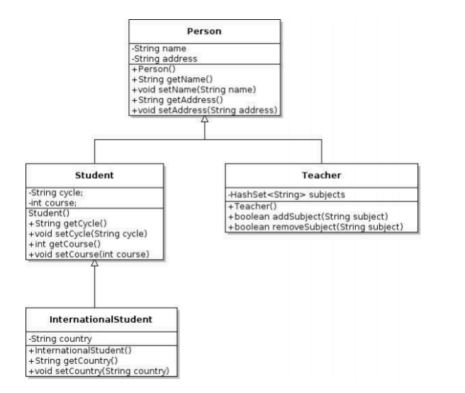
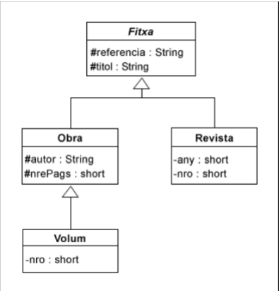
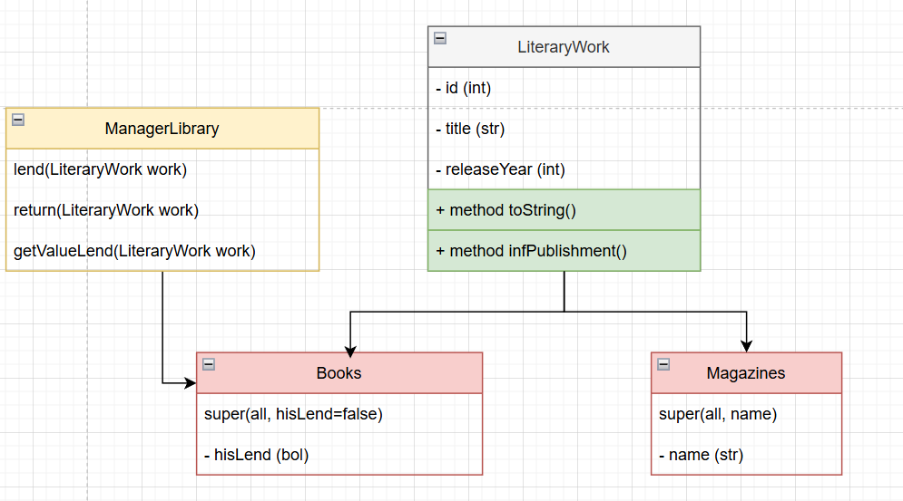
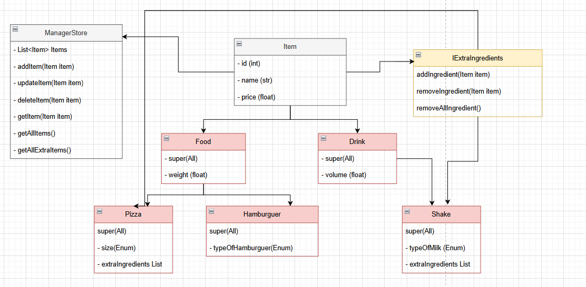
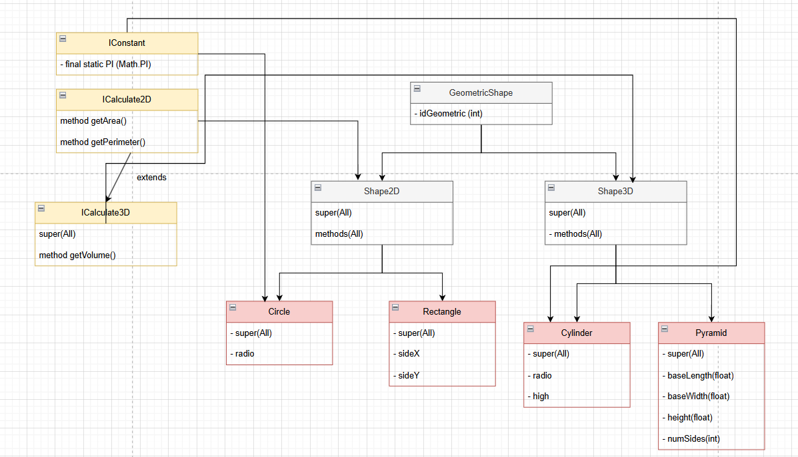
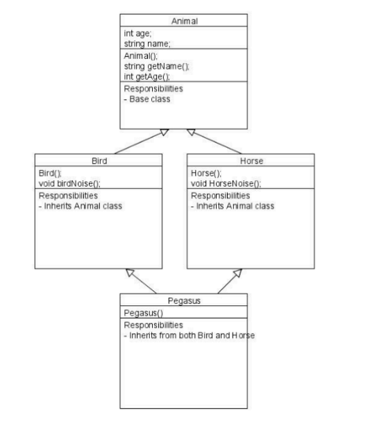

# Activitats Herència ([Part1](src/part1))

## 1.Objecte Geomètric (_[Geometric](src/part1/geometric)_)
- Crea la classe ObjecteGeometric que té:
  - atributs: coord_x, coord_y, color
  - mètodes: constructor, toString()
- Crea la classe Cercle que hereda de ObjecteGeometric i, a més a més, té:
  - atributs: radi
  - mètodes: constructor, toString(), perimetre() i area()
- Crea la classe Quadrat que hereda de ObjecteGeometric i, a més a més, té:
  - atributs: costat
  - mètodes: constructor, toString(), perimetre() i area()

## 2.Vehicles (_[Vehicle](src/part1/vehicle)_)
- Cada vehicle s’identifica per la seva **matrícula**.
- El preu del lloguer de qualsevol vehicle té una component base que depèn dels dies de
  lloguer a raó de 10€ **per dia**.
  - En el cas de lloguer d’un cotxe, al preu base se li suma la quantitat de 1.5€ per plaça i dia.
  - El preu de lloguer del microbusos és igual que el dels cotxes, però se li afegeix una
    quantitat de 2€ per plaça independentment dels dies de lloguer.
  - El preu dels vehicles de càrrega és el preu base més 20€ * PMA (on PMA És el pes
    màxim autoritzats en tones).
  - A més a més, en cas dels camions, al preu se li suma un fixe de 40€ independentment
    dels dies de lloguer.
- Afegir un vehicle.
- Obtenir el preu del vehicle.

## 3.School (_[School](src/part1/school)_)
+ Defineix les classes corresponents al següent diagrama UML.
+ Afegeix constructors a cada classe de manera que el constructor cridi al constructor de la
classe mare i seguidament escrigui per pantalla “Sóc el constructor de la classe xxx”.
Després crea una classe executora (amb un main) dins el mateix package, crea objectes
de cada classe i observa què es mostra per pantalla en cada creació.

## 4-5. Biblioteca IImplementació herència (_[Library](src/part1/library)_)
- L’objectiu d’aquesta activitat és implementar un seguit de classes en Java relacionades
mitjançant herència. 
- Implementeu les classes Fitxa, Obra, Volum i Revista corresponents
a la figura següent, pensades per poder gestionar alguns dels elements que ens podem
trobar en la gestió d’una biblioteca.

+ Els requeriments són els següents:
+ En la creació de la biblioteca cal indicar la seva dimensió.
+ En una biblioteca no hi pot haver dues fitxes amb la mateixa referència.
+ Ha de proporcionar mètodes per:
  1. Conèixer la capacitat de la biblioteca.
  2. Conèixer el nombre d’elements que hi ha en la biblioteca.
  3. Afegir una fitxa a la biblioteca.
  4. Extreure una fitxa a partir de la seva referència.
  5. Proporcionar la fitxa que es troba en una posició determinada en la biblioteca.
  6. Visualitzar el contingut de la biblioteca.
     Desenvolupeu una altra classe, anomenada ProvaBiblioteca, que contingui un mètode
     main() que comprovi la gestió correcta de la classe Biblioteca implementada.

## 6. Empleats (_[Employees](src/part1/employees)_)

- Tenim un sistema on controlem els treballadors que hi ha a la nostra empresa. 
- De l'Empleat guardarem el nom, el cognom, l'edat i el salari. 
- A més de la constructora per defecte i la constructora per paràmetres i dels seus setters&getters, un empleat també tindrà:
  - boolean plus(int plusSalarial). Aquest mètode ha de ser capaç de sumar una quantitat que
    entrarem com a paràmetre si l'empleat té més de 40 anys. Retorna una variable booleana
    per tal d'informar si s'ha apujat el seu salari o no.
  - boolean comprovaNom(): ens comprova que el nom no estigui buit
  - Després tindrem un tipus d'empleat que és un Comercial, d'un comercial guardarem la
    comissio que s'endú. Crea igualment constructores i gettersSetters.
  - A més tenim un empleat que serà el Repartidor. Aquest empleat en guardarem la zona per
    la qual reparteix el producte. Crea igualment constructores i gettersSetters.
  - Fes una classe executora, comprova la creació de diferents tipus d'objectes diferents
    empleat, comercial i repartidor. Compara classes, utilitza el getClass, instanceOf, prova la
    igualtat entre dos Objectes (equalsTo).

# Activitats Classes Abstractes ([Part2](src/part2))

## 1.Transports (_[Transports](src/part2/transports)_)
- Volem modelar diversos tipus de transports: cotxes, bicicletes i metro.
- La informació rellevant relativa a tot els **transports** és:
  - 1. L'identificador
  - 2. La velocitat actual en km/h (podem suposar que és constant).
- La informació rellevant relativa als **cotxes** és:
  - 1. El tipus de combustible.
  - 2. El preu per litre de combustible.
  - 3. Els litres de combustible que gasta un cotxe per cada km recorregut.
- La informació rellevant relativa a les **bicicletes** és:
  - 1. El nombre de marxes.
- La informació rellevant relativa als **metros** és:
  - 1. El preu del bitllet. Cada 5km el preu del bitllet augmenta un 1 euro.
- A partir de les dades anteriors, volem efectuar les operacions següents:
  - Calcular el temps en hores que triga cada vehicle en recórrer una distància en
  quilòmetres, a velocitat constant.
  -  Calcular el preu que hem de pagar com a usuaris de cada vehicle en recórrer una
     distància, el programa ha de demanar la distància recorreguda. Estableix el preu que
     necessitis en cada cas.

## 2.Aquarium (_[Aquarium](src/part2/aquarium)_)

- Volem modelar els components d'un aquari. En un aquari hi viuen animals i plantes. La
 informació rellevant relativa a tots els organismes (peixos i plantes) és:
  1. El nom del peix o de la planta.
  2. La família a la qual pertany
  3. El tipus de llum que necessita l'animal o la planta. La llum estarà codificada amb tres
     lletres en funció de les necessitats de cada organisme: "H" alta, mitjana "M" i baixa "L".
  4. La temperatura màxima que pot tolerar el peix o planta.
  5. La temperatura mínima que pot tolerar el peix o planta.
  6. El PH màxim que pot tolerar el peix o planta.
  7. El PH mínim que pot tolerar el peix o planta.
- La informació rellevant relativa a tots els peixos és:
  - 1. La procedència geogràfica del peix.
  - 2. La dieta codificada segons aquesta escala ("W" Algues, "O" Omnívor, "L" Fulles).
  - 3. La longitud en cm del peix.
- La informació rellevant relativa a totes les plantes és:
  - 1. El tipus de planta, codificant-lo de la següent manera: "S" Tija, "B" Bulb, "R" Arrels
- A partir de les dades anteriors, volem efectuar les operacions següents:
  1. Per a cada organisme, retornar una cadena amb els marges d'acidesa de l'aigua
     acceptables per l'espècie.Per exemple: 6-7.
  2. Per a cada organisme, retornar una cadena amb els marges de temperatura
     acceptables per l'espècie. Per exemple: 10-20.
  3. Per a cada peix, traduir el codi del tipus de dieta a l'explicació pertinent. Si és 'W',
     "Algues", etc.
  4. Per a cada organisme, traduir el codi de tipus de necessitats de llum a l'explicació
     pertinent. Si és 'H', "Necessitats altes de llum", etc.
  5. Per a cada planta, traduir el codi de tipus de planta a l'explicació pertinent. Si és 'S',
     "Tija", etc.

## 3.Areas (_[Areas](src/part2/areas)_)

Volem modelar els espais físics d'un centre escolar.
- La informació rellevant relativa a tots els **espais** és:
   1. El codi identificador.
   2. La superfície en m².
   3. Si disposa de llum natural o no.
   4. El consum elèctric, en Kwh per metre quadrat.
- La informació rellevant dels **despatxos** és:
      1. El nombre de taules.
      2. Si disposa de màquina de cafè.
- La informació rellevant de les **aules** és: 
      1. L'aforament màxim.
      2. Si disposen o no de cadires de pala.
      3. El nombre d'ordinadors.
      4. Si disposen o no de connectors de xarxa.
- La informació rellevant dels **laboratoris** és:
  1. El nombre d'encenedors Bunsen (per escalfar i esterilitzar mostres)
- La informació rellevant de les **aules d'informàtica** és:
  1. El nombre d'impressores.
- La informació rellevant dels **gimnasos** és:
    1. Si té dutxes o no.
    2. El nombre de grades.

## 4.Water (_[Water](src/part2/water)_)

La facturació de l'aigua en una petita ciutat es basa en tres conceptes: consum,
sanejament i residuals.
La informació rellevant relativa de cada factura és:
   1. L'import per consum
   2. L'import per sanejament.
   3. L'import per residuals.
   4. El descompte aplicat per sanejament.
   5. El descompte aplicat per residuals.
A partir de les dades anteriors, volem efectuar les operacions següents:
      1. Calcular l'import de la factura, tenint en compte que:
      - a: Els clients normals, paguen la suma dels tres imports, sense cap tipus de
      descompte.
      - b: Les famílies nombroses de tipus 1, paguen tot el consum però tenen un
      descompte del 25 % en el sanejament i la depuració.
      - c: Les famílies nombroses de tipus 2, paguen tot el consum però tenen un
      descompte del 75 % en el sanejament i del 50 % en la depuració, amb un màxim
      en cadascun d'aquests conceptes de 16 €.
      2. Detallar la factura per pantalla, detallant cadascun dels imports i dels descomptes
         aplicats i de l'import total. Si es tracta d'una factura de família nombrosa de tipus 2 i
         s'afegirà la següent nota al final de la factura:
- NOTA: si l'import màxim de sanejament i residuals és superior a 16, s'ha comptabilitzat
- Per exemple, per a un import de consum de 10€, un import de sanejament de 20€ i un
import de residuals de 30€, tindríem les següents factures depenent del tipus de factura:

# 3. Interfaces ([Part3](src/part3))

## 1 & 2 Answer(_[Answers](https://docs.google.com/document/d/1v3hZeT1xmpDYN5UhHmJp2ZEhBpzNFaX54sbJe84D8ss/edit?usp=sharing)_)

## 3.Library System (_[Library System](src/part3/library)_)

## 4.Pizzeria (_[Pizzeria](src/part3/pizzeria)_)

## 5. Cos Geomètric (_[Geometric](src/part3/geometric)_)

## 6. Herència múltiple (_[Inheritance](src/part3/Inheritance)_)

